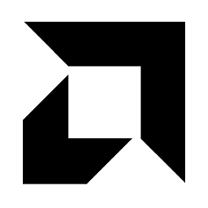
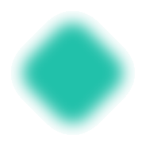

  
  <a href="https://space.bilibili.com/353561345"><b>Bilibili: Molforte</b></a>
  &nbsp;
  

<picture>
  <source media="(prefers-color-scheme: dark)" srcset="https://raw.githubusercontent.com/Molforte/Molforte/output/github-contribution-grid-snake-dark.svg">
  <source media="(prefers-color-scheme: light)" srcset="https://raw.githubusercontent.com/Molforte/Molforte/output/github-contribution-grid-snake.svg">
  
</picture>

## 🛠️ Tech Stack | 技术栈

### Languages | 编程语言

  
  
  

### Tools | 开发工具

  
  
  
  
  
  
  

### Frameworks | 框架

  
  
  

### Content Creation | 内容创作

  
  
  
  
  
  

